# A Five-Stage-Pipeline CPU

## 写在前面

​	此项目我完成的是一个基于mips32的具有五级流水的，包含了21条指令的指令集的cpu，实现了mips32三种基本类型的指令，解决了在流水过程中的数据相关和控制相关，并且对每条指令进行一个仿真测试，可以完成一些基本程序的运行，并将cpu综合到开发板上面，通过led灯将指令流水展示出来，最后写了一个函数来对cpu进行一个上板测试。

​	该课程设计涉及的相关课程很多，主要的有丁贤庆老师的数字逻辑课程，阙夏老师的计算机组成原理课程，李建华老师的计算机体系结构课程，张本宏老师的汇编语言课程，需要自己学习的知识有Verilog硬件语言和FPGA实验板的相关知识。

​	整个的设计过程全部由我一个人独立完成，之所以选择一个人来完成是因为这样可以让我思路逻辑更加清晰，并且可以对cpu有一个更全面的认识，对我未来发展有很大帮助。

> 设计要求: 基于先修课程，根据系统设计思想，使用硬件描述语言设计实现一款基于MIPS32，ARM，RISC-V或者自定义指令集的微处理器（CPU）。
>
> **要求**: 完成单周期CPU设计，或多周期CPU设计，或5级流水线CPU设计（递进式、难度依次提升。所有学生必须至少完成单周期CPU的设计工作），并将设计的CPU下载至FPGA开发板（ego-1）上运行。以此贯穿数字逻辑、计算机组成原理、计算机体系结构课程，实现从逻辑门至完整CPU处理器的设计

## 开发语言与工具

- **开发语言:**  VHDL
- **开发工具:**  Vivado 2019.2

## 设计思路

### 数据流通路

​	cpu总共有十二个部分，分别包括了PC寄存器、id译码模块、ex执行模块、mem访存模块、寄存器堆、流水线暂停模块、指令存储器和数据存储器，以及四个流水线寄存器共同组成。

​	实验过程中参考了雷思磊的《自己动手写cpu》，这本书对我刚开始独立完成cpu框架的搭建极为重要，为我打开了设计cpu的大门，完成了基于openmips的cpu的设计，本次所实现的cpu数据通路如下：

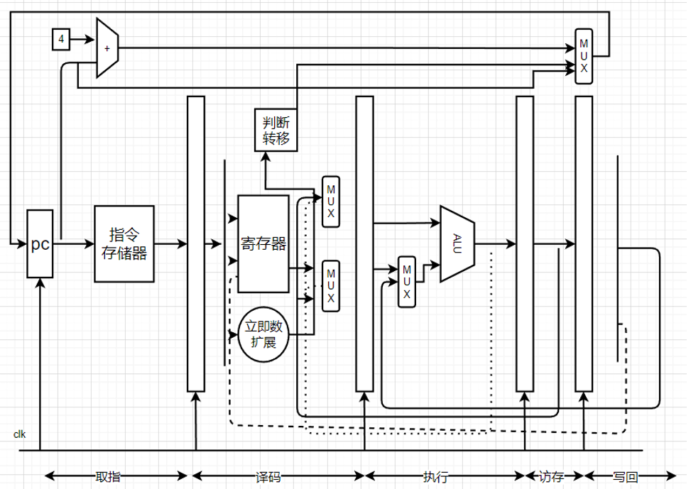

  
图 1  cpu数据通路图  

  

以此构成了五级流水线的mips32cpu，各个阶段完成的主要工作如下：

1. **取指**: 取出指令存储器中的指令，PC值递增，准备取下一条指令。

2. **译码**: 对指令进行译码，依据译码结果，从32个通用寄存器中取出源操作数，有的指令要求两个源操作数都是寄存器的值，比如or指令，有的指令要求其中一个源操作数是指令中立即数的扩展，比如 ori指令，所以这里有两个复用器，用于依据指令要求，确定参与运算的操作数，最终确定的两个操作数会送到执行阶段。

3. **执行**阶段:依据译码阶段送入的源操作数、操作码，进行运算，对于ori指令而言，就是进行逻辑“或”运算，运算结果传递到访存阶段。

4. **访存**阶段:对于ori指令，在访存阶段没有任何操作，直接将运算结果向下传递到回写阶段。

5. **回写**阶段:将运算结果保存到目的寄存器。

对cpu进行封装，封装后的cpu效果如下：

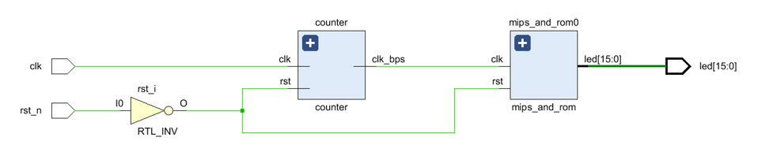

  
图 2 封装效果图1 

  

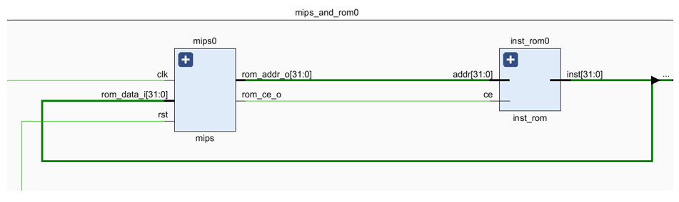

图 3封装效果图2

### 模块介绍

此处简要介绍一下设计的模块, 具体内容详见项目报告.

#### 基本核心模块

1. **PC寄存器**

   PC的作用是给出指令地址，其接口如下：

   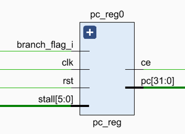

   
图 4 PC寄存器

2. **id模块（译码）**

   ID模块的作用是对指令进行译码，得到最终运算的类型、子类型、源操作数1、源操作数2、要写入的目的寄存器地址等信息，其中运算类型指的是逻辑运算、移位运算、算术运算等，子类型指的是更加详细的运算类型。

   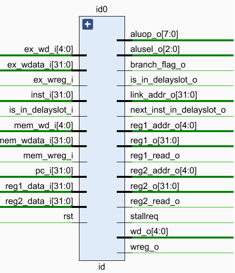

图 5 id模块

3. **ex模块（执行）**

   EX模块会从ID/EX模块得到运算类型alusel_i、运算子类型aluop_i、源操作数regl_i、源操作数reg2_i、要写的目的寄存器地址 wd_i，EX模块会依据这些数据进行运算。

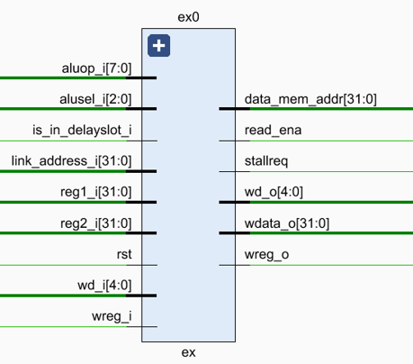

图 6 ex模块
4. **mem模块**

   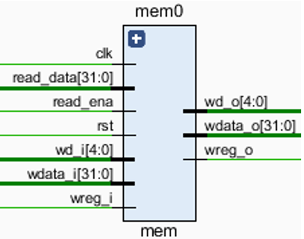

   
图 7 mem模块

5. **regfile寄存器堆**

   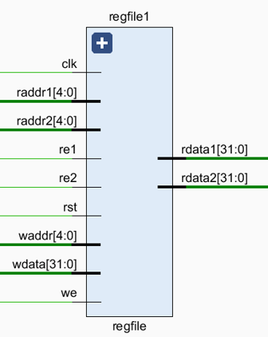

   
图 8 寄存器堆模块

#### 流水线寄存器

1. **取指译码阶段**
   IF/ID模块的作用是暂时保存取指阶段取得的指令，以及对应的指令地址，并在下一个时钟传递到译码阶段。

   
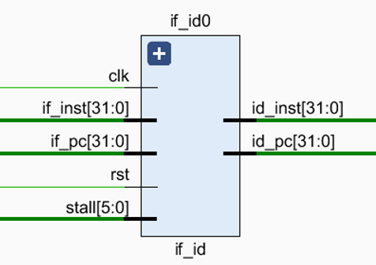

图 9 if_id模块

2. **译码执行阶段**
   ID_EX模块作用是将译码阶段取得的运算类型、源操作数、要写的目的寄存器地址等结果，在下一个时钟传递到流水线执行阶段。

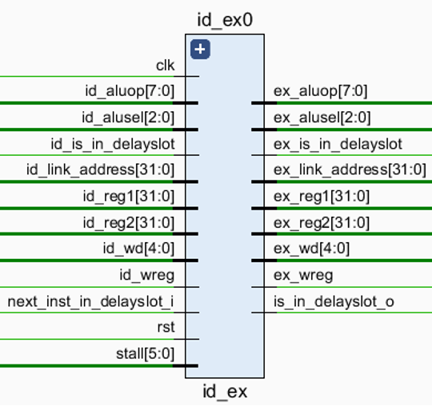

图 10 id_ex模块

3. **执行访存阶段**
   EX/MEM模块作用是将执行阶段取得的运算结果，在下一个时钟传递到流水线访存阶段。

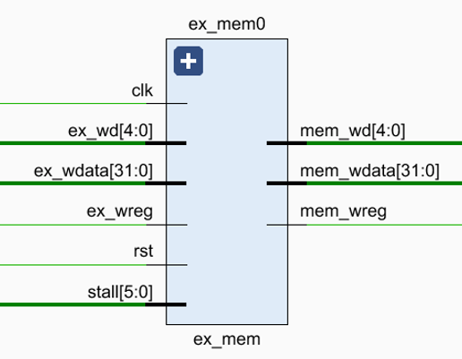

图 11 ex_mem模块图

4. **访存写回阶段**
   MEM/WB模块的作用是将访存阶段的运算结果，在下一个时钟传递到回写阶段。

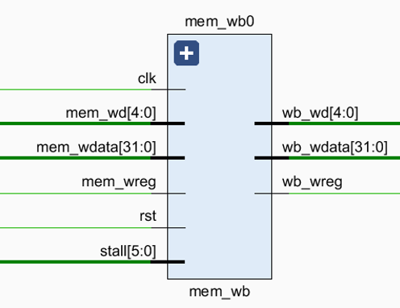

图 12 mem_wb模块

#### 其他相关模块

1. **流水线暂停模块**
   假如位于流水线第n阶段的指令需要多个时钟周期，进而请求流水线暂停，那么需保持取指令地址PC的值不变，同时保持流水线第n阶段、第n阶段之前的各个阶段的寄存器不变，而第n阶段后面的指令继续运行，因此需要设计流水线暂停模块。

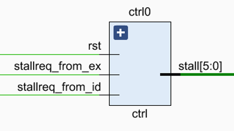

图 13 流水线暂停模块

2. **数据存储器**
   数据存储器的构成，使用了vivado当中的IP核构成，将数据都存储在.coe文件当中，这样是因为自己动手写的rom指令存储器或者数据存储器实际可用的会非常的小，所以最好调用板子上已有的存储器，这样可以更好的加载操作系统或者其他大的程序，容量也很大。

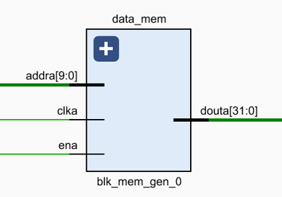

图 14 数据存储器模块

3. **指令存储器**
   指令存储器利用verilog语言编程实现，容量大小为128KB。

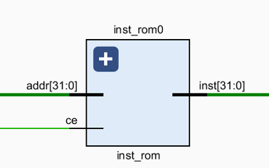

图 15 指令存储器模块

## 设计指令

本次CPU的设计实现了一些基本指令的实现，可以完成所有基本的算术运算和逻辑运算，由于时间原因，有一些运算类型类似但有略微差别的指令我没有再实现，例如addu和add、subu和sub、sltu和slt等等。
具体实现的指令有：

1. **R型指令：** OR   AND   XOR   NOR   SLL   SLR   SRA   ADD   SUB   SLT  MUL   DIV  JR
   注：这里的乘法指令MUL和除法指令DIV我在实现的过程中，由于利用二进制乘除法来进行实现有一定的难度，需要考虑的条件有很多，所以我都进行了一个简化，直接利用verilog语言里面的* / 表达式实现的，但这样的cpu在实际过程中是不建议的因为直接利用verilog乘除来实现会带来很大的开销。

   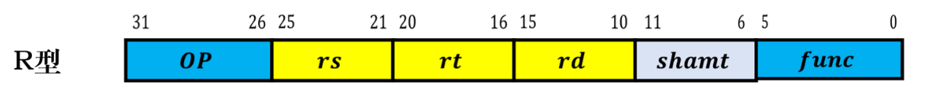

图 16 R型指令机器码格式

2. **I型指令：**ORI   ANDI  XORI  ADDI   LW

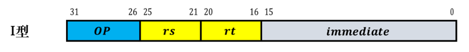

图 17 I型指令机器码格式

3. **J型指令：**J

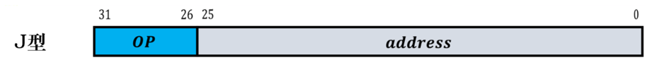

图 18 J型指令机器码格式

## 流水线相关的处理

流水线中的相关分为以下三种类型。

1. **结构相关:**  指的是在指令执行的过程中，由于硬件资源满足不了指令执行的要求，发生硬件资源冲突而产生的相关，在本次课程设计中暂不考虑。
2. **数据相关:**  指的是在流水线中执行的几条指令中，一条指令依赖于前面指令的执行结果。
3. **控制相关:**  指的是流水线中的分支指令或者其他需要改写PC的指令造成的相关。

### 数据相关

​	流水线的数据相关又分为三种情况：RAW、WAR、WAW，根据mips五级流水线的特点并不存在WAR和WAW相关，所以需要解决的只有RAW（写后读）相关，解决这个数据相关主要运用的方法就是**数据前推**。

​	具体做法就是，保存ex、mem、wb阶段的结果传到id当中去，如果译码阶段使用到了，就直接利用，这样就**解决了其对应相邻指令、相隔一条指令、相隔两条指令的数据相关**.

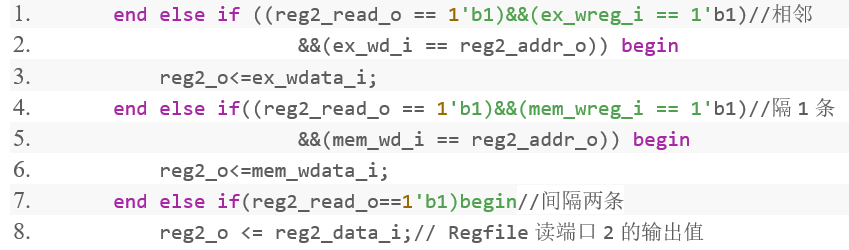

图 19 解决数据相关部分代码

### 控制相关

​		控制相关是指流水线中的转移指令或者其他需要改写PC的指令造成的相关。这些指令改写了PC的值，所以导致后面已经进入流水线的几条指令无效。
解决控制相关的一个方法就是设置延迟槽，所谓延迟槽就是指跳转指令后面的那一条指令，延迟槽指令需要放入和该跳转指令不相关的指令，以至于不影响整个cpu的运行，而那一条指令的放入**不是由cpu决定的，是由编译器决定的**，所以这里我只是简单的实现了延迟槽模块，在id阶段就进行判断是否要进行跳转，只需要添加几个接口判断该指令是否是延迟槽指令即可。

图 20 解决控制相关部分代码

## 运行展示

### 仿真测试

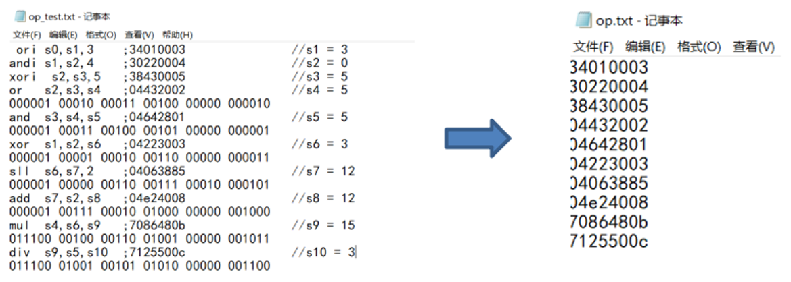

图 21 测试指令

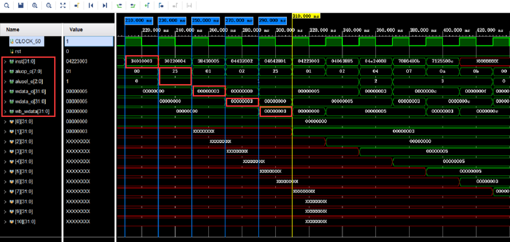

图 22 流水线效果

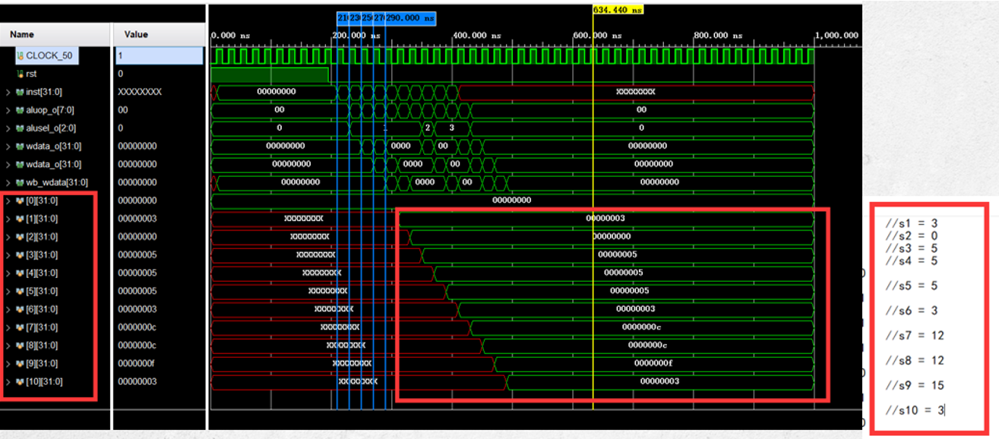

图 23 测试结果

### 上板演示

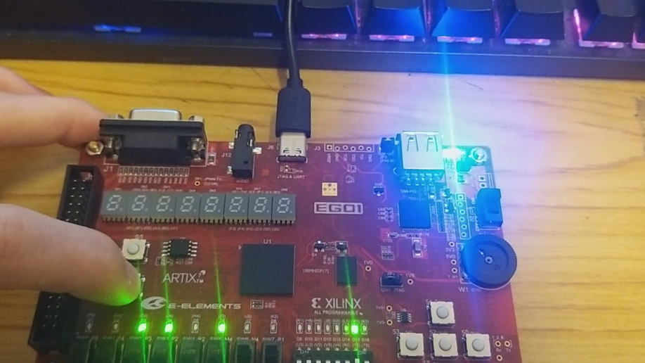

上板测试结果

## 运行说明

下载好项目以后, 将项目导入Vivado中, 修改指令地址即可运行, 此处不再详细赘述.

详细设计结果和运行过程展示以及指令演示内容详见项目文档.

## 参考文献

[1] 雷思磊.自己动手写CPU. 北京: 电子工业出版社，2014.

